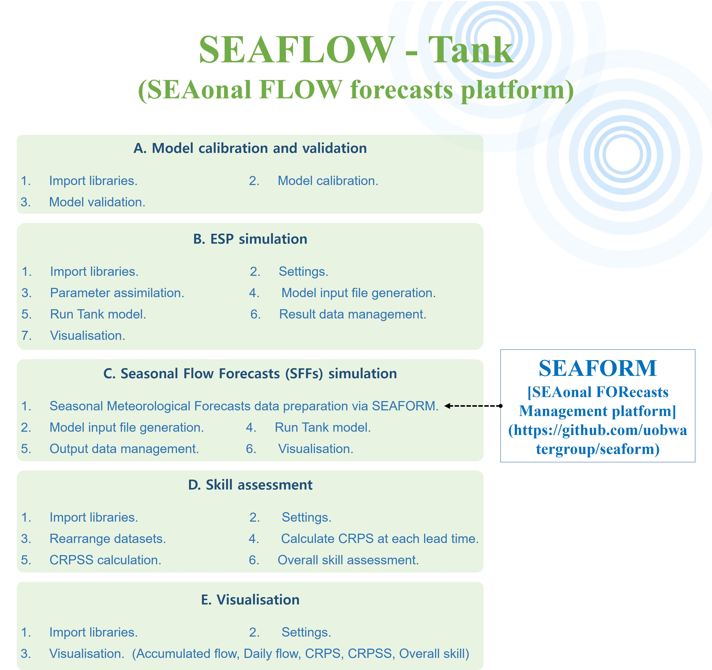

# SEAFLOW (SEAsonal FLOW forecasts platform)

Over the last decade, numerical weather prediction systems have improved their forecasting performance at longer lead times, ranging from 1 to several months ahead (Bauer et al., 2015; Alley et al., 2019). The water management sector may benefit considerably from these advances. 

To increase relevance for water resource management, seasonal weather forecasts can be translated into Seasonal Flow Forecasts (SFFs) via a hydrological model. SFFs can be provided and evaluated at different temporal and spatial resolutions: a coarser resolution, e.g., magnitude of total next-month runoff over a certain region (Prudhomme et al., 2017; Arnal et al., 2018) or a finer resolution, e.g., daily/weekly flow at a particular river section over the next month (Crochemore et al., 2016; Lucatero et al., 2018). 

This toolbox is developted to simulate SFFs and Ensemble Streamflow Predicition(ESP). The data needed to simulate SFFs can be obtained from SEAFORM (https://github.com/uobwatergroup/seaform). For hydrological modelling, this toolbox adopts the conceptual Tank model developed by Sugawara of Japan in 1961 (Sugawara et al., 1986, 1995). This model is widely applied in many countries including South Korea (Ou et al. 2017; Goodarzi et al., 2020).

Through this toolbox, you can automatically calibrate and validate the model, generate flow ensemble of ESP and SFFs. Additionally, assessing the skill of SFFs benchmarked against ESP and visualising the results are also possible.

Let's get started by downloading all the Jupyter Notebook files and folders (including util, assessment folders)

If you find any errors or any comments on this tool, <b>please email me(ocean47ys@gmail.com).</b>
